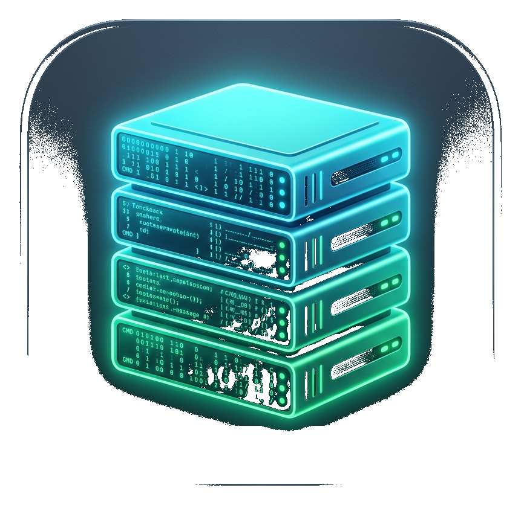

<div align="center">

  

  # Local Dev Server Manager

  **A lightweight, high-performance Linux desktop application to scan, run, configure, and monitor web projects with one click.**

  [](https://github.com)
  [](https://electronjs.org)
  [](https://react.dev)
  [](https://vitejs.dev)
  [](LICENSE)

</div>

---

## ⚡ Why Local Dev Server Manager?

Managing multiple local development servers across different directories can quickly become chaotic. Running `npm run dev` in multiple terminals leaves orphaned processes, port conflicts, and unorganized logs.

**Local Dev Server Manager** brings all your web projects under one clean, modern dashboard. It scans your folders for `package.json`, detects your package manager (`npm`, `pnpm`, `yarn`, `bun`), allows custom port overrides, streams colored ANSI terminal output in real time, and cleans up process trees automatically when servers are stopped.

---

## ✨ Features

- **🔍 Automatic Project Scanner**: Select a root directory (e.g. `~/Projects`) and automatically discover all web projects containing a `package.json`. Heavy directories (`node_modules`, `.git`, `dist`, etc.) are automatically skipped.
- **➕ Manual Project Adder**: Easily add individual project folders via file picker or path input.
- **📊 Modern Dashboard**: Sleek dark glassmorphism card grid showing project status, detected package managers, script selectors, custom port configs, and active server counts.
- **⚡ One-Click Server Execution**: Trigger `npm run dev`, `pnpm dev`, `yarn dev`, or `bun dev` instantly in the background.
- **🎛️ Custom Local Port Control**: Customize the port (`:5173`, `:3000`, `:8080`) per project before running.
- **📺 Live Terminal Log Drawer**: Real-time streaming log drawer with ANSI escape color code rendering, autoscroll, line counters, copy log, and clear log actions.
- **🌐 Localhost URL Auto-Detection**: Real-time regex detection of dev server URLs (e.g. `http://localhost:5173`) with a one-click **"Open in Browser"** button.
- **🛑 Clean Process Tree Termination**: Powered by POSIX signal process killing (`tree-kill` with `SIGTERM`/`SIGKILL`) so sub-processes like Vite worker threads never become zombie processes.

---

## 🚀 Getting Started

### Prerequisites

- **Node.js** (v18 or higher)
- **npm** (v9 or higher)

### Installation

```bash
# Clone repository
git clone https://github.com/QudurMSY/local-dev-server-manager.git

# Navigate into project directory
cd local-dev-server-manager

# Install dependencies
npm install
```

### Running the App (Direct Standalone Executable)

Launch the native desktop window directly loading static built assets from disk (`file://`), **spawning zero HTTP dev servers for the manager UI itself**:

```bash
# Run direct bash launcher
./start-app.sh

# Or via npm
npm start
```

### Desktop Shortcut (Linux)

You can also run or double-click `LocalDevServerManager.desktop` or launch it directly from your Linux application menu!

---

## 🛠️ Tech Stack

- **Desktop Framework**: Electron
- **UI Frontend**: React 18 + Vite 6
- **Styling**: Modern Vanilla CSS Design Tokens (Glassmorphic Dark Theme)
- **Process Spawning**: Node.js `child_process.spawn`
- **Process Cleanup**: `tree-kill` (POSIX `SIGTERM` / `SIGKILL`)
- **Terminal Rendering**: `ansi-to-html` ANSI color escape parser
- **Icons**: Lucide React + Custom 3D Server Matrix Icon

---

## 📂 Project Structure

```
local-dev-server-manager/
├── electron/
│   ├── main.js             # Electron main process & POSIX process manager
│   └── preload.js          # Secure IPC contextBridge API
├── src/
│   ├── main.jsx            # React entry point
│   ├── App.jsx             # Main state container & IPC listeners
│   ├── index.css           # Modern glassmorphism CSS theme
│   ├── components/
│   │   ├── Header.jsx      # Top navbar with scan, search & batch stop
│   │   ├── StatsBar.jsx    # Metric overview & quick filters
│   │   ├── ProjectCard.jsx # Project item card with script & port control
│   │   ├── LogDrawer.jsx   # Live ANSI terminal drawer
│   │   └── ManualAddModal.jsx # Manual directory input modal
│   └── utils/
│       └── ansi.js         # ANSI log renderer helper
├── assets/
│   ├── icon.png            # Transparent 3D app icon
│   └── icon.svg            # Vector app icon
├── start-app.sh            # Direct executable bash launcher
└── package.json
```

---

## 📝 License

Distributed under the MIT License. See `LICENSE` for details.
